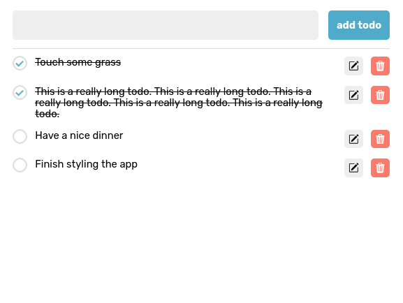
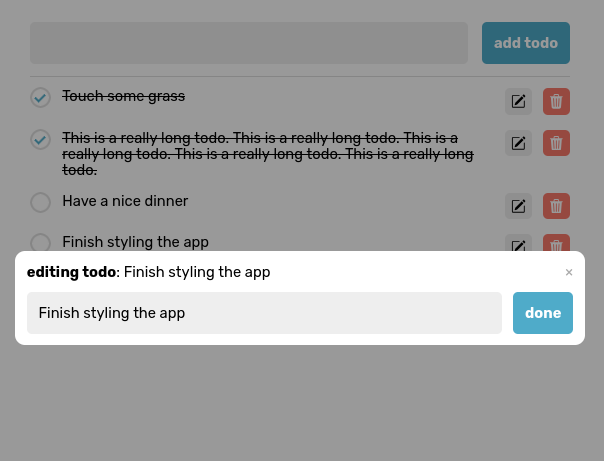

# Todo Good

Simple todo app created for learing purposes

## Postgresql Help

The devshell contains the latest version of Postgresql

```sh
initdb -D .tmp/pgdata -U postgres -A md5 --pwfile=password

pg_ctl -D .tmp/pgdata -l logfile -o "-k $PGHOST" start

pg_ctl -D .tmp/pgdata stop

pgcli -U postgres
```

## Screenshots




## TODO

- [ ] Make development experience less of a headache
    - i.e., automate database directory making, etc.
- [ ] Implement a user system
- [ ] Make instructions for running
